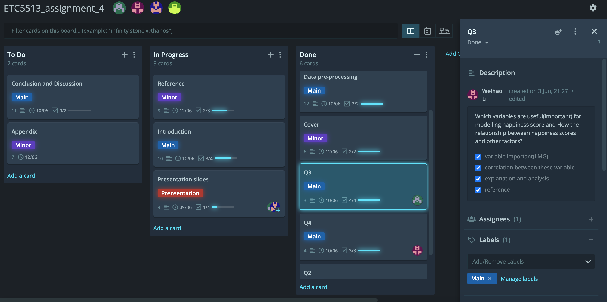

```{r setup, include=FALSE}
knitr::opts_chunk$set(echo = FALSE)
library(tidyverse)
```

```{r titleslide, child="components/titleslide.Rmd"}
```

---
# GitKrahen Board


---
# Tools
## R Markdown
 1. Template: MonashEBSTemplates
 2. Figure setting: fig.width = 8, fig.height = 5, fig.alig = "center"
 3. Table style: Kable_styling with "striped","hover"
 4. Biblio-style: APA
   
## Git
 1. GitKrahen Board
 2. Git status
 3. Git fetch
 4. Git merge (conflicts ?)
 5. Git amend
---
```{r endslide, child="components/endslide.Rmd"}
```


